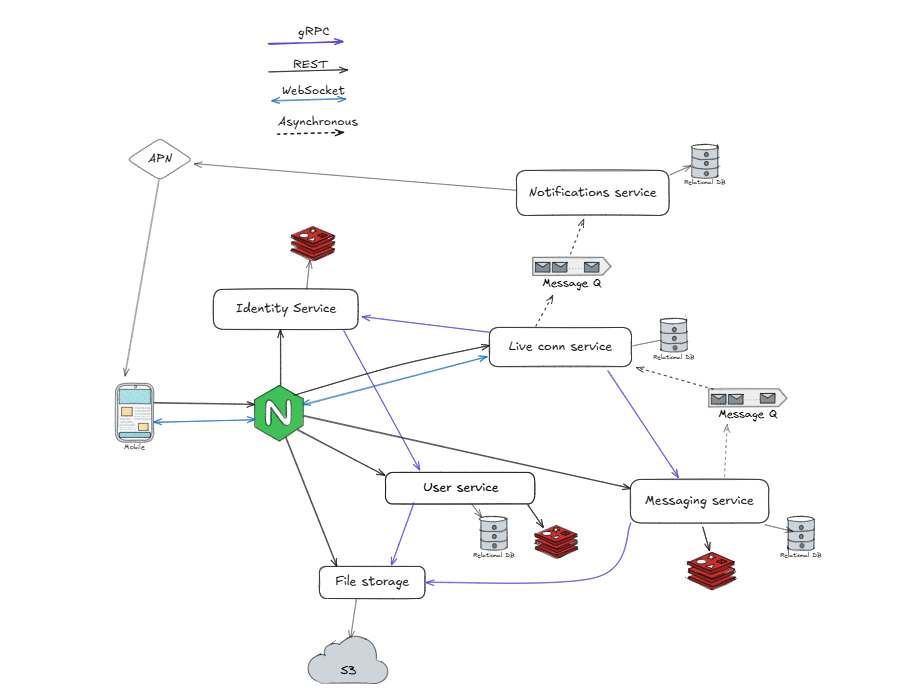

# About 
This is a messenger with secret mode where synchoronous e2e encryption is used.

# Architecture

# Contributing
If you want to contribute to this project, please read [CONTRIBUTING.md](CONTRIBUTING.md) first.